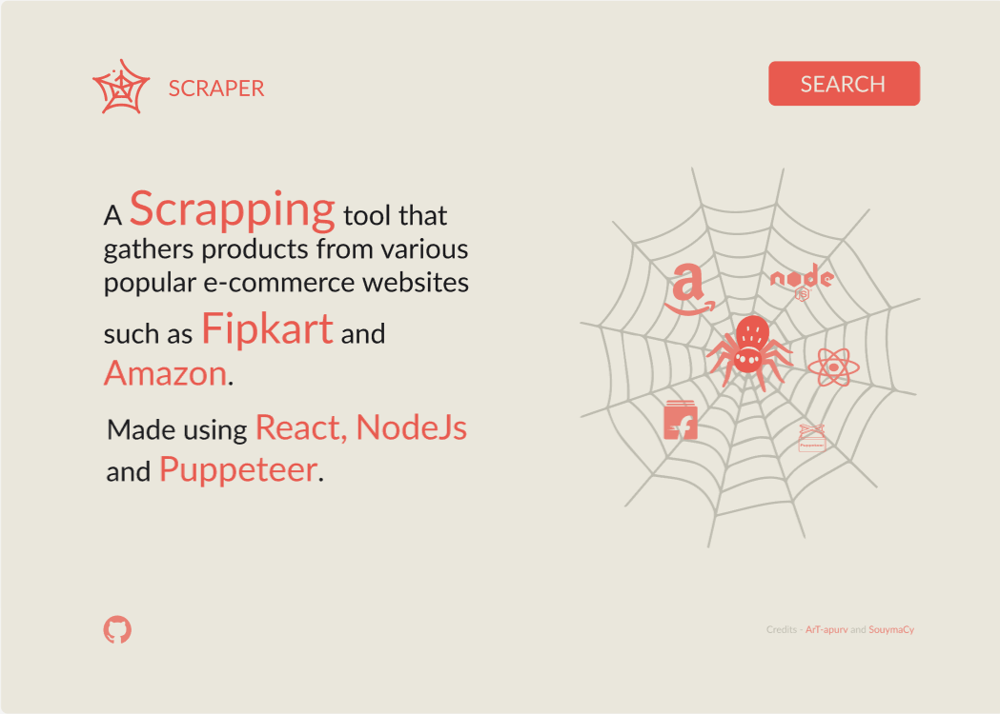
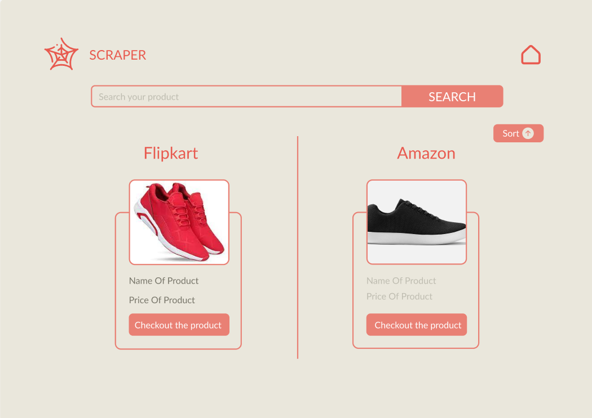

# Products

A tool that compares the search results of both amazon and flipkart at a single place.
Made with the help of Node,React.Js and Puppeteer.

## Local Installation & Set Up

1.  Puppeteer uses chromium so make sure you have installed its latest version in your project root folder.

2.  Ensure [nvm](https://github.com/nvm-sh/nvm) and [npm](https://www.npmjs.com/) are installed globally

3.  Install the correct version of Node

    ```shell
    nvm install
    ```

4.  Install dependencies

    ```shell
    npm install
    ```

5.  Run the React app on <http://localhost:3000> and the Node server on <http://localhost:5000>

    ```shell
    npm start
    ```

6.  In the Search page use the search bar to look for the search results in various e-commerce websites simultaneously.

## Landing Page

<p align="center">
  
</p>

## Search Page

<p align="center">
  
</p>
